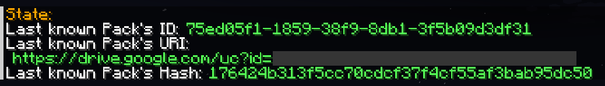
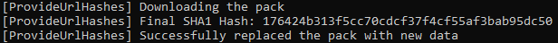

## Remember Url Hashes

### What It Does
This plugin helps your players avoid re-downloading server resource packs when you already have them.  

### Why Is This Plugin Needed?
- Vanilla Minecraft already tries to do this, but **if the server doesn't have** SHA1 hash manually specified in server.properties, the client downloads the pack every time  
- The plugin stores previous hashes and other resource pack data and the server sends that hash to players based on the url  
- If your pack url stays the same between updates, you can easily run a command **to update the hash**  
- You can even **set a new pack URL** from console and automatically prepare it's hash!  

### Commands

The plugin keeps track of your server resource pack's id, url **and SHA-1 hash**:  

#### Updating the hash
If you updated the pack's url, the plugin will update the hash automatically, because the URL changed.  
But if your link is always the same, you can easily run a command to **update the hash** whenever you want:  

- `/urlHashesUpdateHash` to **update the SHA-1 hash**  

Or even tell the plugin to completely change the link to a new version and update the hash:  

- `/urlHashesChangePackUrl` to **change the resource pack link** and update hashes  
Note: this command can only be executed from console by default for security reasons  

Both will tell you about starting to download the pack to determine it's hash:

And the rest of that process will be visible in your console:

You can tell the plugin to save the data between restarts:

- `/urlhashestogglesaving` to toggle **data saving**

### Config Options

You can edit plugin's settings in the config (`plugins/config/ProvidePackHashes`)
The only exclusive option there at the moment is whether you allow players (with permissions) to change the pack URL, or just console (by default).

### Supported Environment
PaperMC servers (1.21.1+)  

### Alternative approach
You can have the same behaviour on your client, if you play on a server with this issue and you aren't an administrator.  
For this, use my Fabric client-side mod: [Remember Url Hashes](https://modrinth.com/mod/rememberurlhashes/)  